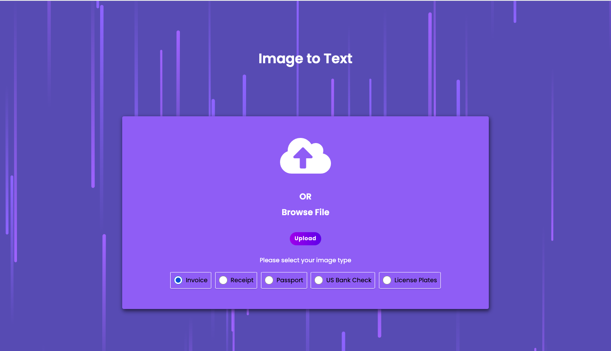
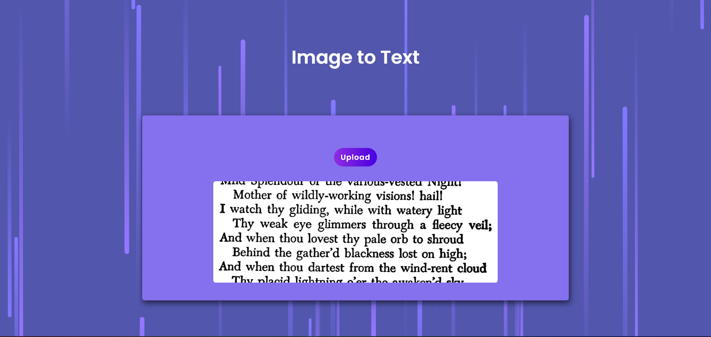
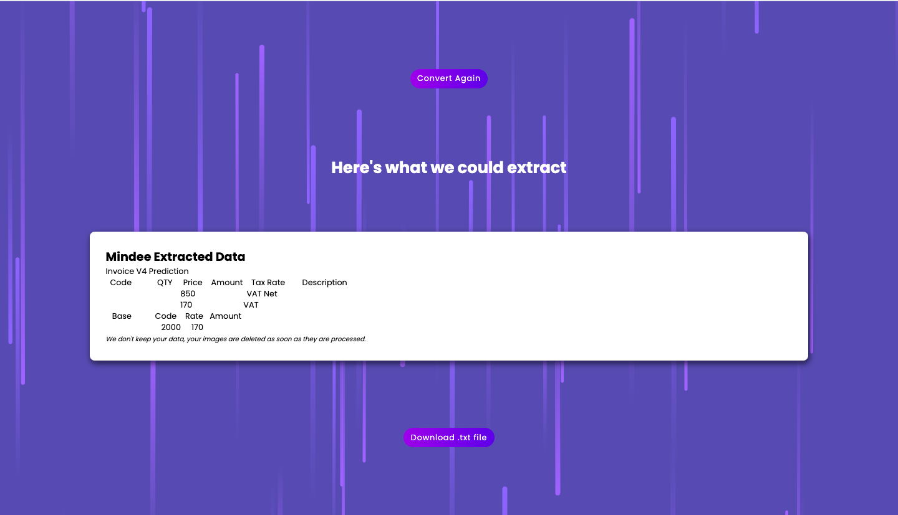
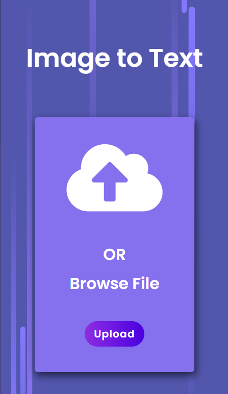
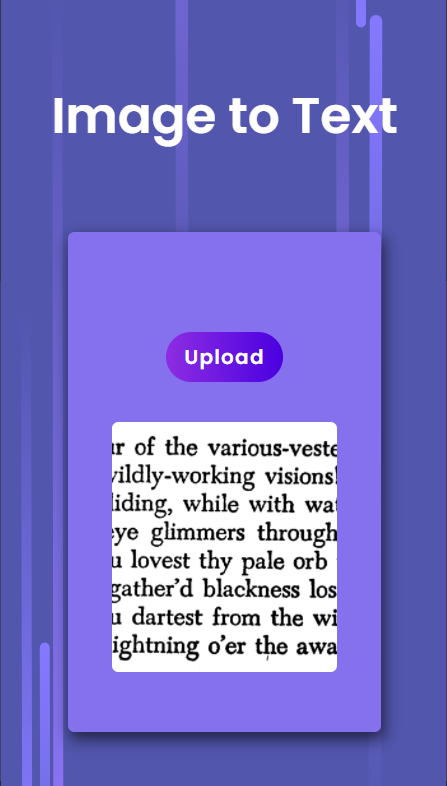
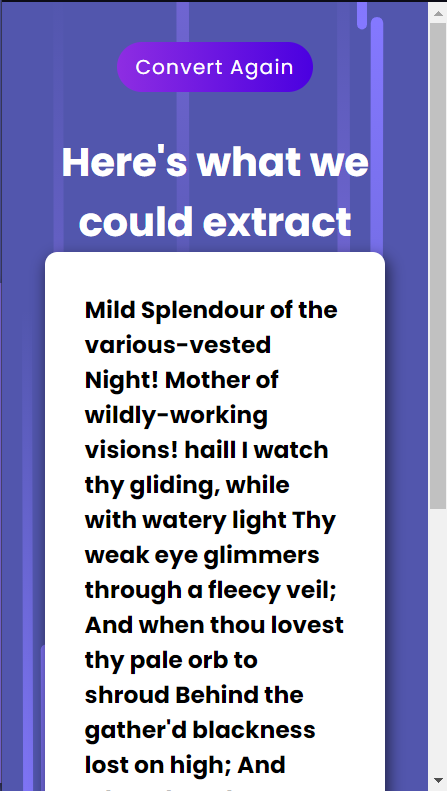

# OCR (Optical Character Reader) App

An Image to Text (OCR) Node application deployed using Tesseract.js and deployed on Hereoku. You can upload a local image having handwritten data on it. It will then be converted into text which can then be downloaded into .txt file.

## Demo

https://ocr-image-text.herokuapp.com
  
## Deployment

To deploy this project run

```bash
  npm start
```

## NPM packages used
- dotenv
- ejs
- express
- multer
- fs-extra
- tesseract.js
- uuid
## Features

- Simple text to .txt
- downloadable .txt file
- Simple UI

  
## Screenshots





Mobile first view





  
## Support

For support, email adihgr18@gmail.com

  
